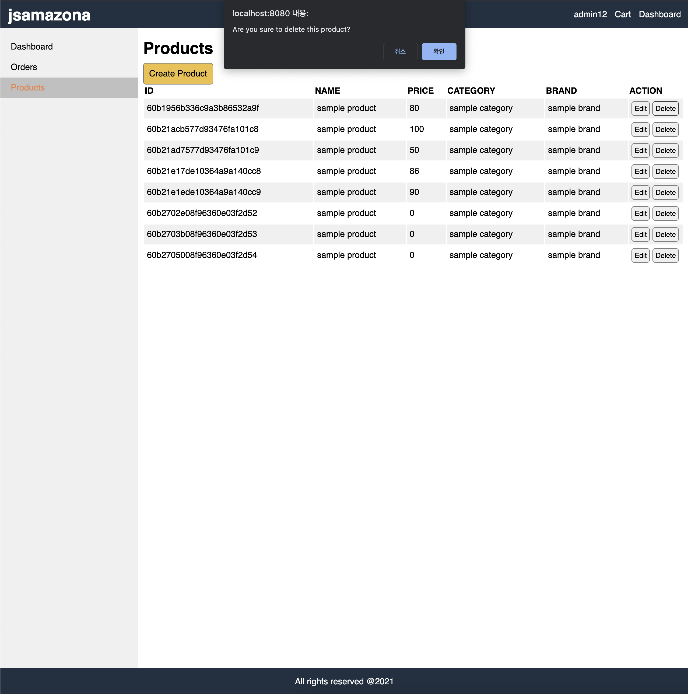

# JS AMAZONA CLONE PROJECT

# 설명 
- Vanilla JS & MongoDB & express를 이용한 ECommerce Site 프로젝트 (아마존 clone)

# 실행
1. MongoDB 다운로드 & 실행  
- [mongoDB](https://www.mongodb.com/try/download/community)에서 다운로드
2. .env 파일 생성
- 프로젝트 최상단에 .env파일 생성
```js
//.env file
MONGODB_URL=mongodb://localhost/jsamazona
JWT_SECRET=somethingsecret
PAYPAL_CLIENT_ID=db //페이팔 key입력
```
3. Backend
```shell
$ npm install
$ npm run build
$ npm run start
```
4. Frontend
```shell
$ cd frontend
$ npm install
$ npm run start
```
5. 관리자 계정 생성 & 로그인
- [http://localhost:5000/api/users/createadmin](http://localhost:5000/api/users/createadmin)에 접속해서 관리자 email, password 확인 
- [http://localhost:8080/#/signin](http://localhost:8080/#/signin)에 접속해서 미리 확인해둔 관리자 email, password 입력 후 로그인


# 스크린샷


# 기능 
- 로그인 & 회원가입


- 유저 프로필

- 제품 상세 화면
    - Add to Cart 버튼 클릭 -> Cart페이지에 제품이 추가된다
    
- 쇼핑카트 

    - Proceed to checkout(결제진행) 버튼 클릭
    - 배송지 정보 입력 화면
    
    - 결제수단 선택
    
    - place order(주문하기)버튼 클릭
    
    - 페이팔 결제
    
    
        - 개발자 계정을 사용해서 페이팔 결제를 테스트용으로 진행 
        - [페이팔공식사이트](https://www.paypal.com/kr/webapps/mpp/home?locale.x=ko_KR?&kid=p27206541111&gclid=CjwKCAjwzMeFBhBwEiwAzwS8zChpOc_jk9XfnxhFfJ9iiye8oklqEw-00HUNGQBorEBkvfRhfdI56BoC9kUQAvD_BwE&gclsrc=aw.ds)에서 회원가입후 아래 개발자페이지로 이동 로그인한다.
        [페이팔개발자 홈페이지](https://developer.paypal.com/classic-home)
    
- 관리자 계정 기능
    
    - 상단 header부분에 Dashboard가 추가됨
    - 대시보드 
        - 회원수, 총 주문 량, total 결제 금액
        - 차트
        
        - 제품 관리
        
            - Create Product 버튼 클릭 시 제품 등록 폼 화면으로 이동
            - Edit 버튼 클릭 시 제품 정보 수정 폼 화면으로 이동(제품 등록 폼과 일치함)
            
            - Delete 버튼 클릭 시 경고창 표시 삭제할지 한 번더 확인
            
        - 주문 내역 관리
        


# Modules
- ## nodemon
- nodemon은 `node monitor`의 약자로, 노드가 실행하는 파일이 속한 디렉터리를 감시하고 있다가 파일이 수정되면 자동으로 노드 애플리케이션을 재시작하는 확장 모듈로 개발 중인 노드 애플리케이션의 소스 코드를 수정할 때마다 매번 노드 명령어를 통해 새로 시작할 필요가 없으므로 매우 편리합니다.
```shell
npm i -D nodemon
```
- node 명령어 대신 nodemon을 사용해서 파일을 실행해 준다.
` nodemon app.js`

- ## body-parser
- HTTPpost put 요청시 request body 에 들어오는 데이터값을 읽을 수 있는 구문으로 파싱함과 동시에 req.body 로 입력해주어 응답 과정에서 요청에 body 프로퍼티를 새로이 쓸 수 있게 해주는 미들웨어
- express 문서에 따르면 미들웨어 없이req.body 에 접근하는 경우에는 기본으로undefined 가 설정되어 있으므로 bodyParser, multer와 같은 미들웨어를 사용하여 요청 데이터 값에 접근해야 한다는 안내를 찾을 수 있다.

```shell
npm i body-parser
```

- ## cors
- CORS는 Cross-Origin Resource Sharing의 약자로 도메인 또는 프로토콜, 포트가 다른 서버의 자원을 요청하는 매커니즘을 말한다.
- 하지만 동일 출처 정책(same-origin policy)때문에 `CORS` 같은 상황이 발생하면 외부 서버에 요청한 데이터를 브라우저에서 보안 목적을 차단한다. 때문에 서버나 클라이어트 단에서 특정 도메인 혹은 모든 도메인을 허용하도록 설정하여 해결해야 한다.
- CORS문제의 해결방법 중 하나가 cors 미들웨어를 사용하는 것이다.

```shell
npm i cors
```
- ## dotenv
- dotenv는 환경변수를 .env파일에 저장하고 process.env로 로드하는 의존성 모듈이다.
- dotenv를 사용하는 이유는 우리가 개발을 하는 과정에서 `서버주소`, `고유 API KEY 값` 등 필요한 정보들을 저장을 하게 된다. 그리고 이러한 정보들은 민감한 정보임과 동시에 보안이 이루어져야 하는 정보들이다. 만약 이러한 정보들이 오픈소스(깃허브)에 공개될 경우, 해킹을 당하거나 보안적인 면에서 위험할 수 있다.
- 이러한 문제로 dotenv패키지를 이용하여 환경변수 파일(`.env`)을 외부에 만들어 접근할 수 있게 하고, 개발 초기 단계에서 세팅하기를 권고한다.

```shell
npm i dotenv
```

- ## jsonwebtoken
- JSON Web Token은 정보를 안전하게 전송하기 위해 정의 공개된 표준이다.
- NodeJS에서 JWT(jsonwebtoken) 생성 및 검증을 지원하는 모듈
- [JWT공식사이트](https://jwt.io/) - JWT를 생성하거나 검증할 수 있다.
```shell
npm i jsonwebtoken
```

- ## mongoose
- Mongoose는 Node.js와 MongoDB를 위한 ODM(Object Data Mapping) library이다. Java 기반의 Hibernate. iBatis 등의 ORM(Object Relational Mapping)과 유사한 개념이다.
- ODM의 사용은 코드 구성이나 개발 편의성 측면에서 장점이 많다. 호환성이 없는 프로그래밍언어(JavaScript) Object와 MongoDB의 데이터를 Mapping하여 간편한 CRUD를 가능하게 한다.
- 필요에 따라 확장 및 변경이 가능한 자체 검증(Validation)과 타입 변환(Casting)이 가능하며 Express와 함께 사용하면 MVC Concept 구현이 용이하다.

[사이트](https://poiemaweb.com/mongoose)참고

```shell
npm i mongoose
```

- ## axios
- Axios는 브라우저, Node.js를 위한 Promise API를 활용하는 HTTP 비동기 통신 라이브러리입니다.
- api 호출을 위해서 가장 많이 사용하는 라이브러리 중 하나이다.
- [홈페이지](https://xn--xy1bk56a.run/axios/guide/)를 참고해주세요

```shell
npm i axios
```

- ## Multer
- Multer는 파일 업로드를 위해 사용되는 `multipart/form-data` 를 다루기 위한 node.js 의 미들웨어 입니다. 효율성을 최대화 하기 위해 busboy 를 기반으로 하고 있습니다.
- [Multer-github](https://github.com/expressjs/multer/blob/master/doc/README-ko.md)
```shell
npm i multer
```

- ## chartist
- Chart Javascript 라이브러리 중의 하나로 SVG를 사용하며, CSS를 통해 모양을 다듬을 수 있습니다.
- [ChartList](http://gionkunz.github.io/chartist-js/)
```shell
cd frontend
npm i chartist
```

# history

1. record
    1. jsamazona root 폴더 생성
    2. frontend & backend 폴더 생성 (프론트 백 구분)
    3. frontend 폴더에 src 폴더 생성
    4. src폴더 > 프론트단 구성 파일 
    5. frontend 폴더 > screen폴더 > view 파일
    6. frontend 폴더 > images폴더 > 프로젝트에서 사용하는 이미지 
    7. frontend 폴더 -> axios(HTTP 비동기 통신 라이브러리)사용
    8. frontend 폴더 -> package.json ->webpack 사용
        - app.js -> index.js로 이름 변경 (webpack에서 index.js를 main.js로 변환)
    9. utils.js ->  parseRequestURL(), Indicator(로딩바) 구성
    10. index.js -> router, routes 
    11. root jsamazona folder > backend 폴더 생성
    12. root jsamazona folder -> package.json -> express, babel, nodemon 사용
        - babel(자바스크립트 컴파일러) : 최신문법(es6 이상)을 브라우저에서 사용가능한 하위 버전으로 바꿔준다(es5이하)
        - 따라서 backend 폴더 > server.js에서 require()대신 import from 구문 사용
    13. eslint airbnb-base사용
    14. mongoDB 설치 (DB->mongodb사용)
    15. npm install mongoose dotenv
        - mongoose : MongoDB ODM(Object Document Mapping -> 객체(Javascript)와 문서(MongoDB)를 1대1 매칭)
        - dotenv : DB관련 정보 등 보안이 필요한 정보를 외부 파일로(환경변수 파일 -> .env)만들어 관리하는 페키지 
    16. npm install body-parser express-async-handler jsonwebtoken  
        - body-parser : API 요청(POST, PUT)에서 받은 body(req.body) 값을 파싱하는 역할을 수행하는 미들웨어
        - express-async-handler : express router에서 async 함수를 호출할 때 오류가 발생함 -> router에서 async/await 사용하기위한 wrapper 라이브러리
        - jsonwebtoken : 정보를 JSON객체 형태로 주고 받기 위한 표준규약에 따라 생성한 암호화된 문자열(토큰) 회원인증에서 사용
    17. localStorage.js
        - 브라우저 localStorage에 카트에 담을 정보 set & get 기능, 사용자 정보 set & get 삭제 기능 작성 
        - 배송정보(Shipping), 구매정보(Payment) 추가
    18. Token 인증 타입 Bearer 사용
        - access token 서버에 제출해서 인증을 해야한다 -> 이때 인증 방법이 Bearer Authentication이다.
        - Bearer - JWT 혹은 OAuth에 대한 토큰을 사용한다.(토큰요청헤더 Authorization필드의 타입)
        - 사용시 header과 아닌 headers를 사용해야 오류가 안 난다.
    19. Checkout-wizard -> 결제 기능 구현
        - 1단계 : (signin)로그인 완료 
        - 2단계 : (shipping) 배송정보 입력
        - 3단계 : (payment) 결제 paypal
        - 4단계 : (place order) 주문화면
        - Checkoutsteps component 생성
        - redirectUser() -> cart에 상품이 있을경우 shipping화면으로 , 상품이 없을 경우 메인화면으로 이동
    20. HTTP - respomse code
        - 200 => "OK"
        - 201 => "Created"
        - backend > routers > orderRouter.js -> res.status를 201로 보냈기 때문에 
        - frontend > src > api.js > createOrder에서 
        ```js
        if (response.statusText !== 'Created') {
            throw new Error(response.data.message);
        }
        ```
        statusText code를 Created로 체크한다.
    21. data의 id 형식은 24자리의 16진수여야 합니다.
        - MongoDB 에서는 데이터가 쌓일 경우, 그 데이터 하나하나를 document라고 하며 document는 ObjectId를 가진다.
        - ObjectId는 16진수 24자리로 이루어져 있다.
    22. 페이팔 사용하기
        - live(라이브 버전 - 실제 사용)
        - sandbox(샌드박스 버전 - 테스트 용)
        - 개발 / 연동 / 테스트 할 경우 샌드박스 계정을 생성해서 사용해야 한다.
        - [페이팔 한국 사이트](https://www.paypal.com/kr/webapps/mpp/merchant)에서 비지니스 계정으로 회원가입 
        -  [페이팔 개발자 사이트](https://developer.paypal.com/developer/applications/)에서 로그인
        - sandbox를 유지한 상태로 Create app 버튼 클릭 App Name 설정 (jsamazona) 샌드박스 비지니스 계정을 선택
        - App을 생성하면 Client Id 생성됨 Client Id를 .env파일에 작성해준다.
    23. 로그인한 유저가 admin인 경우 dashboard 화면 보여줌